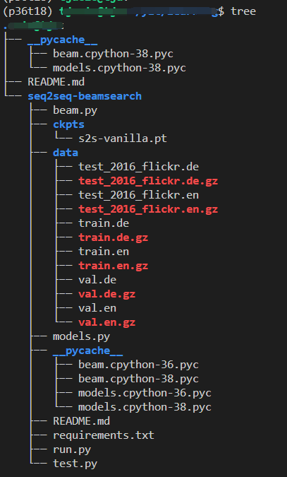

# Seq2Seq Beam Search Decoding for Pytorch

## 安装依赖
```shell
# 安装 spacy 和requirements中依赖
pip install spacy torchtext==0.9

# 分别安装两个语言扩展
python -m spacy download de
python -m spacy download en
```
## 调试修改心得

torchtext在更新到0.9之后数据集multi30k有较大改动, 各种api也有较大变化, 不再需要 Field 等方法

[参考教程](https://pytorch.org/tutorials/beginner/torchtext_translation_tutorial.html)

multi30k 现在被移入experimental中, 根据上方参考教程, 重新预处理数据

so..主要代码的改动在run.py中170-200行附近

目录结构如下图, 注意传入的 multi30k root参数



attention测试运行通过

## 基础知识

生成目标: 得到模型最优(概率最高)的文本, 即 P(Y|X) 最大

最优解: 遍历所有词, 比较生成概率 -> 搜索空间 V 的t次方, t是句子长度, 所以有了贪心搜索和集束搜索

存在问题: 牺牲时间换性能, 但即便在GPT-2上, 也倾向于生成重复语句, 如"哈哈哈哈"

### Teacher Forcing

它是一种网络训练方法，对于开发用于机器翻译，文本摘要，图像字幕的深度学习语言模型以及许多其他应用程序至关重要。它每次不使用上一个state的输出作为下一个state的输入，而是直接使用训练数据的标准答案(ground truth)的对应上一项作为下一个state的输入。

具体见 model 中 Seq2Seq 中 forward 部分

问题:因为依赖标签数据，在训练过程中，模型会有较好的效果，但是在测试的时候因为不能得到ground truth的支持，所以如果目前生成的序列在训练过程中有很大不同，模型就会变得脆弱。

也就是说，这种模型的cross-domain能力会更差，也就是如果测试数据集与训练数据集来自不同的领域，模型的performance就会变差

### beam search

集束搜索也是解决 Teacher Forcing 性能的一种办法

## 原README

This is a sample code of beam search decoding for pytorch. `run.py` trains a translation model (de -> en). 

There are two beam search implementations.
- `beam_search_decoding` decodes sentence by sentence. Although this implementation is slow, this may help your understanding for its simplicity.

- `batch_beam_search_decoding` decodes sentences as a batch and faster than `beam_search_decoding` (see the execution time in the below log). I believe that current implementation is not reasonable since there are lot of `for loop` implementations and there are much space for batch processing.

Both ouputs of two implementaions must be the same.


## How to Use?
```
// trains vanilla seq2seq model
% python run.py

// Or trains seq2seq model with attention
% python run.py --attention

// Or load pretrained vanilla model
% python run.py --model_path ./ckpts/s2s-vanilla.pt --skip_train
// Or load pretrained attention model
% python run.py --attention --skip_train --model_path ./ckpts/s2s-attn.pt
Number of training examples: 29000
Number of validation examples: 1014
Number of testing examples: 1000
Unique tokens in source (de) vocabulary: 7855
Unique tokens in target (en) vocabulary: 5893
In: <SOS> . schnee den über laufen hunde mittelgroße zwei <EOS>
for loop beam search time: 8.718
Out: Rank-1: <SOS> two medium brown dogs run across the snow . the snow . <EOS>
Out: Rank-2: <SOS> two medium brown dogs run across the snow . <EOS>
Out: Rank-3: <SOS> two medium brown dogs run across the snow . the snow . . <EOS>
Out: Rank-4: <SOS> two medium brown dogs run across the snow . . <EOS>
Out: Rank-5: <SOS> two medium brown dogs run across the snow . snow . <EOS>
Batch beam search time: 2.994
Out: Rank-1: <SOS> two medium brown dogs run across the snow . the snow . <EOS>
Out: Rank-2: <SOS> two medium brown dogs run across the snow . <EOS>
Out: Rank-3: <SOS> two medium brown dogs run across the snow . the snow . . <EOS>
Out: Rank-4: <SOS> two medium brown dogs run across the snow . . <EOS>
Out: Rank-5: <SOS> two medium brown dogs run across the snow . snow . <EOS>
In: <SOS> . <unk> mit tüten gehsteig einem auf verkauft frau eine <EOS>
for loop beam search time: 9.654
Out: Rank-1: <SOS> a woman is selling on her
Out: Rank-2: <SOS> a woman woman selling a
Out: Rank-3: <SOS> a woman is her selling
Out: Rank-4: <SOS> a woman is selling vegetables on a sidewalk
Out: Rank-5: <SOS> a woman woman selling rice
Out: Rank-6: <SOS> a woman is selling her on
Out: Rank-7: <SOS> a woman is selling watermelon on a
Out: Rank-8: <SOS> a woman is selling on the
Out: Rank-9: <SOS> a woman is sells selling
Out: Rank-10: <SOS> a woman selling selling on
Batch beam search time: 3.256
Out: Rank-1: <SOS> a woman is selling on her
Out: Rank-2: <SOS> a woman woman selling a
Out: Rank-3: <SOS> a woman is her selling
Out: Rank-4: <SOS> a woman is selling vegetables on a sidewalk
Out: Rank-5: <SOS> a woman woman selling rice
Out: Rank-6: <SOS> a woman is selling her on
Out: Rank-7: <SOS> a woman is selling watermelon on a
Out: Rank-8: <SOS> a woman is selling on the
Out: Rank-9: <SOS> a woman is sells selling
Out: Rank-10: <SOS> a woman selling selling on
In: <SOS> . bushaltestelle einer an sitzt anzug im mann ein <EOS> <pad> <pad>
for loop beam search time: 10.151
Out: Rank-1: <SOS> a man in a suit is sitting at a bus stop . <EOS>
Out: Rank-2: <SOS> a man in a suit sits at a bus stop . <EOS>
Batch beam search time: 3.383
Out: Rank-1: <SOS> a man in a suit is sitting at a bus stop . <EOS>
Out: Rank-2: <SOS> a man in a suit sits at a bus stop . <EOS>
```

## References
- [C5W3L08 Attention Model, Andrew Ng.](https://www.youtube.com/watch?v=quoGRI-1l0A&list=LLJENudvIT4mHIwNFAMlX29Q&index=2&t=0s)
- https://github.com/budzianowski/PyTorch-Beam-Search-Decoding
